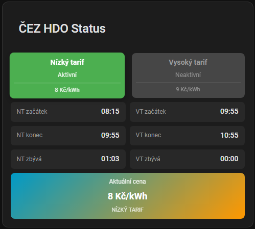

# ⚡️ČEZ HDO (Home Assistant) ⚡️

🇬🇧 [English version](README_EN.md)

> 🔴 **UPOZORNĚNÍ PRO UŽIVATELE VERZE 2.x:**
> Před upgradem na v3.0.0 si přečtěte [**Upgrade Guide**](docs/cs/upgrade-guide.md)!
> Verze 3.0.0 přináší zásadní změny a vyžaduje manuální kroky.

Integrace pro Home Assistant, která načítá HDO (nízký/vysoký tarif)
z API ČEZ Distribuce a vytváří entity + Lovelace kartu.

> ⚠️ **Neoficiální integrace** – Tento projekt není oficiálním produktem
> společnosti ČEZ Distribuce a.s. Jedná se o komunitní projekt vytvořený
> pro potřeby uživatelů Home Assistantu. Autor nemá žádnou vazbu na ČEZ.

Pokud mě chcete podpořit můžete zde

## 🤝 Spolupracovníci

Děkuji všem spoluautorům, kteří se aktivně podílejí na vývoji kódu této integrace:

<!-- readme: collaborators -start -->
<table>
    <tbody>
        <tr>
            <td align="center">
                <a href="https://github.com/pokornyIt">
                    
                     
                    <b>pokornyIt</b>
                </a>
            </td>
            <td align="center">
                <a href="https://github.com/VojtechJurcik">
                    
                     
                    <b>VojtechJurcik</b>
                </a>
            </td>
        </tr>
    </tbody>
</table>
<!-- readme: collaborators -end -->

## 🚀 Rychlý start

### 1. Instalace přes HACS

### 2. Restart Home Assistant

### 3. Přidání integrace

1. **Nastavení → Zařízení a služby → + Přidat integraci**
2. Vyhledejte **ČEZ HDO**
3. Zadejte **EAN** (18 číslic z faktury)
4. Vyberte **signál** (pokud je více možností)
5. Zadejte **ceny** NT a VT (Kč/kWh)

### 4. Přidání karty

V Lovelace přidejte kartu **ČEZ HDO Card** (nebo `custom:cez-hdo-card`).

> **Poznámka:** Po instalaci může být potřeba stisknout `Ctrl+F5`
> pro vyčištění cache.

## 🎴 Lovelace karta

Karta má vizuální editor s možnostmi zobrazení:

- Stavy tarifů (NT/VT aktivní)
- Časy začátku/konce tarifů
- Zbývající čas do změny
- Aktuální cena
- 7denní HDO rozvrh

 

### Nastavení cen

Ceny se nastavují v **integraci**
(Nastavení → Zařízení a služby → ČEZ HDO → Konfigurovat), ne v kartě.

> **Pro změnu ceny:** Projděte všechny kroky konfigurace – nastavení ceny je až na konci.

### Energy Dashboard

Senzor `sensor.cez_hdo_currentprice_*` lze použít jako zdroj ceny v Energy Dashboard.

## 📦 Vytvářené entity

| Typ | Entita | Popis |
| --- | ------ | ----- |
| Binary | `cez_hdo_lowtariffactive_*` | NT je aktivní |
| Binary | `cez_hdo_hightariffactive_*` | VT je aktivní |
| Sensor | `cez_hdo_lowtariffstart_*` | Čas začátku NT |
| Sensor | `cez_hdo_lowtariffend_*` | Čas konce NT |
| Sensor | `cez_hdo_lowtariffremaining_*` | Zbývající čas NT |
| Sensor | `cez_hdo_hightariffstart_*` | Čas začátku VT |
| Sensor | `cez_hdo_hightariffend_*` | Čas konce VT |
| Sensor | `cez_hdo_hightariffremaining_*` | Zbývající čas VT |
| Sensor | `cez_hdo_currentprice_*` | Aktuální cena (Kč/kWh) |
| Sensor | `cez_hdo_schedule_*` | 7denní HDO rozvrh |

> **Poznámka:** `*` označuje vaši zvolenou příponu (např. `doma` nebo `7606_a1b4dp04`).

## ⚠️ Upgrade z v2.x

Verze 3.0.0 přináší **zásadní změny**:

1. **Smazat YAML konfiguraci** z `configuration.yaml`
2. **Aktualizovat** přes HACS
3. **Restart** Home Assistant
4. **Smazat staré entity** (Nastavení → Entity → smazat vše obsahující `cez_hdo`)
5. **Přidat integraci** přes GUI
6. **Smazat složku** `www/cez_hdo/`

Detailní postup: [docs/cs/upgrade-guide.md](docs/cs/upgrade-guide.md)

## 🔧 Řešení problémů

1. **Ctrl+F5** – vyčistit cache prohlížeče
2. **Reload integrace** – Nastavení → Zařízení a služby → ČEZ HDO → Znovu načíst
3. **Zkontrolovat logy** – Nastavení → Systém → Protokoly

### Diagnostika

Pro nahlášení chyby exportujte diagnostiku:

1. Nastavení → Zařízení a služby → ČEZ HDO
2. Klikněte na zařízení → ⋮ → **Stáhnout diagnostiku**
3. Přiložte k [GitHub Issue](https://github.com/Cmajda/ha_cez_distribuce/issues)

## 📚 Dokumentace

- [Uživatelský návod (CZ)](docs/cs/user-guide.md) – kompletní dokumentace
- [User Guide (EN)](docs/en/user-guide.md) – complete documentation (English)
- [Upgrade Guide (CZ)](docs/cs/upgrade-guide.md) – přechod z v2.x na v3.0.0
- [Upgrade Guide (EN)](docs/en/upgrade-guide.md) – migration from v2.x to v3.0.0
- [Service Guide (CZ)](docs/cs/service-guide.md) – dostupné služby
- [Service Guide (EN)](docs/en/service-guide.md) – available services
- [Developer Guide (CZ)](docs/cs/developer-guide.md) – pro vývojáře
- [Developer Guide (EN)](docs/en/developer-guide.md) – for developers
- [Známé problémy (CZ)](docs/cs/known-issues.md) – seznam známých problémů
- [Known Issues (EN)](docs/en/known-issues.md) – list of known issues

## 📝 Release Notes

Viz [RELEASE_NOTES.md](RELEASE_NOTES.md)

## 📄 Licence

Apache 2.0 + Commons Clause (nekomerční použití) | Podpora: [GitHub Issues](https://github.com/Cmajda/ha_cez_distribuce/issues)
