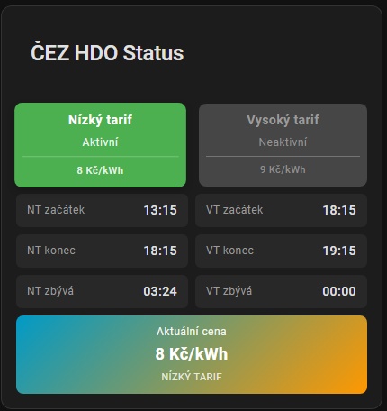
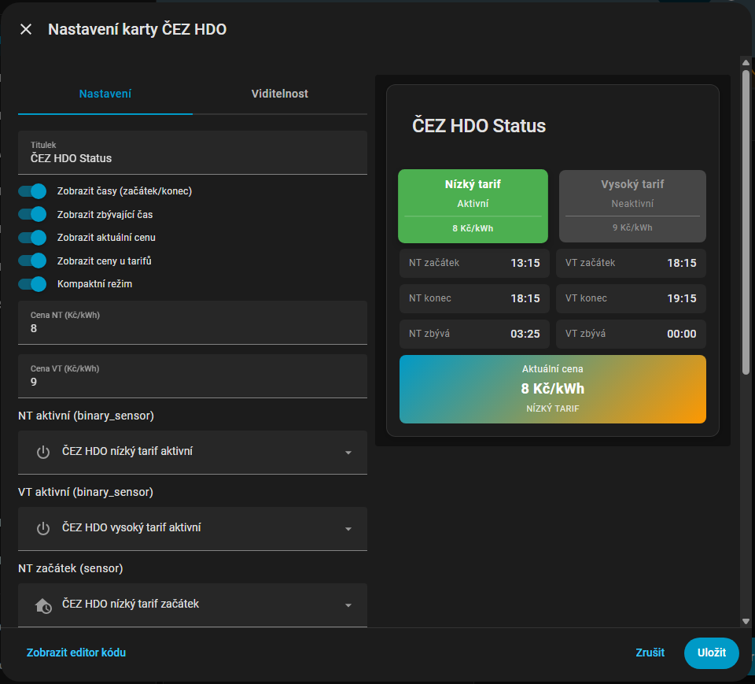
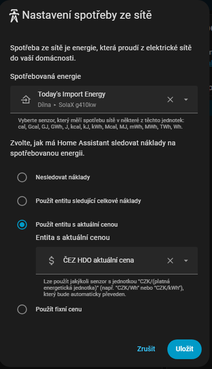

# ⚡️ČEZ HDO (Home Assistant) ⚡️

[](https://github.com/hacs/integration)
[](https://github.com/Cmajda/ha_cez_distribuce/releases)
[](https://github.com/Cmajda/ha_cez_distribuce/actions/workflows/validate.yaml)
[](https://github.com/Cmajda/ha_cez_distribuce/actions/workflows/ci.yaml)

Integrace pro Home Assistant, která načítá HDO (nízký/vysoký tarif) z API ČEZ Distribuce a vytváří entity + volitelnou Lovelace kartu.

Jedná se o **NEOFICIÁLNÍ  ** doplněk pro **HACS** (instalace jako *Custom repository*). Pokud ještě HACS nemáte, nainstalujte ho podle [návodu](https://hacs.xyz/docs/setup/download/).

## 📑 Obsah

- [📑 Obsah](#-obsah)
- [🚀 Rychlý start](#-rychlý-start)
- [🎴 Lovelace karta](#-lovelace-karta)
  - [🖼️ Ukázka](#️-ukázka)
    - [Konfigurace Karty](#konfigurace-karty)
  - [📅 HDO rozvrh](#-hdo-rozvrh)
  - [📊 Použití v Energy Dashboard](#-použití-v-energy-dashboard)
- [📦 Vytvářené entity (výchozí názvy)](#-vytvářené-entity-výchozí-názvy)
- [🔧 Když to nefunguje (doporučený postup)](#-když-to-nefunguje-doporučený-postup)
- [📚 Dokumentace](#-dokumentace)

## 🚀 Rychlý start

1. Nainstalujte integraci přes HACS (Custom repository):

[](https://my.home-assistant.io/redirect/hacs_repository/?category=Integration&owner=Cmajda&repository=ha_cez_distribuce)

2. Přidejte do `configuration.yaml` (přesně takto):

```yaml
# Senzory pro integraco CEZ HDO
sensor:
  - platform: cez_hdo
    ean: "Váš EAN"

binary_sensor:
  - platform: cez_hdo
    ean: "Váš EAN"
```

3. Restart Home Assistant.
4. V Lovelace přidejte kartu `custom:cez-hdo-card`.

## 🎴 Lovelace karta

- Karta má UI editor, kde si vyberete entity.
- Když necháte pole s entitami prázdné, karta použije výchozí entity (pokud existují).
- Po instalaci/aktualizaci a restartu HA může být potřeba jednou udělat `Ctrl+F5`, aby se karta objevila v seznamu karet.

### 🖼️ Ukázka

V editoru karty zapněte přepínač "Zobrazit HDO rozvrh" pro aktivaci vizualizace.

  

#### Konfigurace Karty



### 📅 HDO rozvrh

Karta obsahuje vizualizaci 7denního HDO rozvrhu s barevnými bloky pro nízký (zelená) a vysoký (oranžová) tarif:


V editoru karty zapněte přepínač "Zobrazit HDO rozvrh" pro aktivaci vizualizace.

### 📊 Použití v Energy Dashboard

Senzor `sensor.cez_hdo_aktualni_cena` lze použít jako zdroj ceny elektřiny v Energy kartě Home Assistantu:



## 📦 Vytvářené entity (výchozí názvy)

Binary sensories:

- `binary_sensor.cez_hdo_nizky_tarif_aktivni` – nízký tarif je aktivní (`on/off`)
- `binary_sensor.cez_hdo_vysoky_tarif_aktivni` – vysoký tarif je aktivní (`on/off`)

Senzory:

- `sensor.cez_hdo_nizky_tarif_zacatek` – čas začátku NT (např. `01:10`)
- `sensor.cez_hdo_nizky_tarif_konec` – čas konce NT (např. `08:30`)
- `sensor.cez_hdo_nizky_tarif_zbyva` – zbývající čas do změny tarifu
- `sensor.cez_hdo_vysoky_tarif_zacatek` – čas začátku VT
- `sensor.cez_hdo_vysoky_tarif_konec` – čas konce VT
- `sensor.cez_hdo_vysoky_tarif_zbyva` – zbývající čas do změny tarifu
- `sensor.cez_hdo_aktualni_cena` – aktuální cena elektřiny v Kč/kWh (lze použít v Energy Dashboard)
- `sensor.cez_hdo_rozvrh` – 7denní rozvrh HDO pro vizualizaci v kartě
- `sensor.cez_hdo_surova_data` – surová data / timestamp (diagnostika)

## 🔧 Když to nefunguje (doporučený postup)

Pokud se karta nezobrazuje, hlásí chybu, nebo integrace po instalaci “nejede”:

1. Vynutit refresh: `Ctrl+F5`
2. Odinstalovat doplněk (HACS)
3. Pokud existuje složka `www/cez_hdo`, smažte ji
4. Znovu nainstalovat doplněk
5. Restart Home Assistant
6. Vynutit refresh: `Ctrl+F5`

## 📚 Dokumentace

- Kompletní návod pro uživatele: [docs/user-guide.md](docs/user-guide.md)
- Services a signály: [docs/service-guide.md](docs/service-guide.md)
- Upgrade / čistá reinstalace: [docs/upgrade-guide.md](docs/upgrade-guide.md)
- Pro vývojáře: [docs/developer-guide.md](docs/developer-guide.md)

Licence: MIT | Podpora: [GitHub Issues](https://github.com/Cmajda/ha_cez_distribuce/issues)
