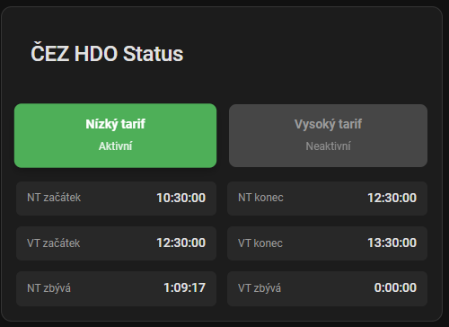

# CEZ HDO - Senzor pro Home Assistant

[](https://github.com/hacs/integration)  

[](https://my.home-assistant.io/redirect/hacs_repository/?category=Integration&owner=Cmajda&repository=ha_cez_distribuce)

Integrace vychází z původního kódu uživatele [@zigul](https://github.com/zigul). [Repozitář](https://github.com/zigul/HomeAssistant-CEZdistribuce)  
Tento senzor stahuje data z webu https://www.cezdistribuce.cz/cs/pro-zakazniky/spinani-hdo.html. Integrace vyžaduje **region** a **kód**. Tyto informace lze získat ze smlouvy s ČEZ CZ nebo z https://www.cezdistribuce.cz/cs/pro-zakazniky/spinani-hdo.html.  
**Region** a **kód** je třeba definovat v souboru configuration.yaml.
Pro otestování zda je správně použit region a kod, lze otevřít odkaz v prohlížeči ve tvaru:

`https://www.cezdistribuce.cz/webpublic/distHdo/adam/containers/`REGION`?code=`kód  

Příklad:  
```
https://www.cezdistribuce.cz/webpublic/distHdo/adam/containers/stred?code=405
```

Tento senzor zobrazuje
- aktuální stav HDO zda je aktivní nízký nebo vysoký tarif
- začátek a konec nízkého/vysokého tarifu
- zbývající čas aktivního tarifu

## Karta Entity



### Yaml code
```yaml
type: entities
entities:
  - entity: binary_sensor.cez_hdo_hightariffactive
  - entity: binary_sensor.cez_hdo_lowtariffactive
  - entity: sensor.cez_hdo_lowtariffstart
  - entity: sensor.cez_hdo_lowtariffend
  - entity: sensor.cez_hdo_lowtariffduration
  - entity: sensor.cez_hdo_hightariffstart
  - entity: sensor.cez_hdo_hightariffend
  - entity: sensor.cez_hdo_hightariffduration
state_color: true

```
## Instalace

### Krok 1: Stažení souborů

#### Možnost 1: Přes HACS

Ujistěte se, že máte nainstalovaný HACS. Pokud ne, spusťte `curl -sfSL https://hacs.xyz/install | bash -` v HA.
Poté zvolte položku "Components" v rámci HACS. Vyberte menu v pravém horním rohu a zvolte "Custom repositories". Pak přidejte URL tohoto repozitáře. Měli byste mít možnost zvolit "Install now".

#### Možnost 2: Manuální
Klonujte tento repozitář nebo stáhněte zdrojový kód jako ZIP soubor a přidejte/slučte složku `custom_components/` s jejím obsahem do vašeho konfiguračního adresáře.

### Krok 2: Konfigurace
Přidejte následující kód do vašeho souboru `configuration.yaml`:

```yaml
# Příklad záznamu v configuration.yaml pro zobrazení aktuálního stavu HDO
binary_sensor:
  - platform: cez_hdo
    region: stred
    code: 405

sensor:
  - platform: cez_hdo
    region: stred
    code: 405
```
nastavte svůj **region** a **kód**  

#### Podporované regiony:
* západ
* sever
* střed
* východ
* morava

> [!WARNING]
> :skull_and_crossbones: V `configuration.yaml` nepoužívejte diakritiku :skull_and_crossbones:!

### Krok 3: Restartování HA
Pro načtení nově přidané integrace je třeba restartovat Home Assistant.

Reference
PRE Distribuce - Senzor pro Home Assistant (https://github.com/slesinger/HomeAssistant-PREdistribuce)