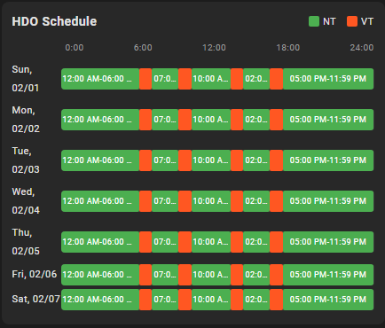

# ⚡️ ČEZ HDO (Home Assistant) ⚡️

🇨🇿 [Česká verze](README.md)

Home Assistant integration that fetches HDO (low/high tariff) data
from ČEZ Distribuce API and creates entities + Lovelace card.

> ⚠️ **Unofficial integration** – This project is not an official product
> of ČEZ Distribuce a.s. It is a community project created
> for Home Assistant users. The author has no affiliation with ČEZ.

If you want to support me, you can do so here:

## 🤝 Contributors

Thanks to all co-authors who actively contribute to the development of this integration:

<!-- readme: collaborators -start -->
<table>
    <tbody>
        <tr>
            <td align="center">
                <a href="https://github.com/pokornyIt">
                    
                     
                    <b>pokornyIt</b>
                </a>
            </td>
            <td align="center">
                <a href="https://github.com/VojtechJurcik">
                    
                     
                    <b>VojtechJurcik</b>
                </a>
            </td>
        </tr>
    </tbody>
</table>
<!-- readme: collaborators -end -->

## 🚀 Quick Start

### 1. Install via HACS

### 2. Restart Home Assistant

### 3. Add Integration

1. **Settings → Devices & Services → + Add Integration**
2. Search for **ČEZ HDO**
3. Enter your **EAN** (18-digit number from your electricity bill)
4. Select **signal** (if multiple options available)
5. Enter **prices** for NT and VT (CZK/kWh)

### 4. Add Card

In Lovelace, add the **ČEZ HDO Card** (or `custom:cez-hdo-card`).

> **Note:** After installation, you may need to press `Ctrl+F5`
> to clear the browser cache.

## 🎴 Lovelace Card

The card has a visual editor with display options:

- Tariff states (NT/VT active)
- Tariff start/end times
- Remaining time until change
- Current price
- 7-day HDO schedule

 

### Price Settings

Prices are configured in the **integration**
(Settings → Devices & Services → ČEZ HDO → Configure), not in the card.

### Energy Dashboard

The sensor `sensor.cez_hdo_*_aktualni_cena` can be used as a price source in the Energy Dashboard.

## 📦 Created Entities

| Type | Entity | Description |
| ---- | ------ | ----------- |
| Binary | `*_nizky_tarif_aktivni` | NT (low tariff) is active |
| Binary | `*_vysoky_tarif_aktivni` | VT (high tariff) is active |
| Sensor | `*_nizky_tarif_zacatek` | NT start time |
| Sensor | `*_nizky_tarif_konec` | NT end time |
| Sensor | `*_nizky_tarif_zbyva` | NT remaining time |
| Sensor | `*_vysoky_tarif_zacatek` | VT start time |
| Sensor | `*_vysoky_tarif_konec` | VT end time |
| Sensor | `*_vysoky_tarif_zbyva` | VT remaining time |
| Sensor | `*_aktualni_cena` | Current price (CZK/kWh) |
| Sensor | `*_rozvrh` | 7-day HDO schedule |

## ⚠️ Upgrade from v2.x

Version 3.0.0 brings **major changes**:

1. **Delete YAML configuration** from `configuration.yaml`
2. **Update** via HACS
3. **Restart** Home Assistant
4. **Delete old entities** (Settings → Entities)
5. **Add integration** via GUI
6. **Delete folder** `www/cez_hdo/`

Detailed guide: [docs/en/upgrade-guide.md](docs/en/upgrade-guide.md)

## 🔧 Troubleshooting

1. **Ctrl+F5** – clear browser cache
2. **Reload integration** – Settings → Devices & Services → ČEZ HDO → Reload
3. **Check logs** – Settings → System → Logs

### Diagnostics

To report a bug, export diagnostics:

1. Settings → Devices & Services → ČEZ HDO
2. Click on device → ⋮ → **Download diagnostics**
3. Attach to [GitHub Issue](https://github.com/Cmajda/ha_cez_distribuce/issues)

## 📚 Documentation

- [User Guide (CS)](docs/cs/user-guide.md) – complete documentation (Czech)
- [User Guide (EN)](docs/en/user-guide.md) – complete documentation (English)
- [Upgrade Guide (CS)](docs/cs/upgrade-guide.md) – migration from v2.x to v3.0.0 (Czech)
- [Upgrade Guide (EN)](docs/en/upgrade-guide.md) – migration from v2.x to v3.0.0
- [Service Guide (CS)](docs/cs/service-guide.md) – available services (Czech)
- [Service Guide (EN)](docs/en/service-guide.md) – available services
- [Developer Guide (CS)](docs/cs/developer-guide.md) – for developers (Czech)
- [Developer Guide (EN)](docs/en/developer-guide.md) – for developers

## 📝 Release Notes

See [RELEASE_NOTES.md](RELEASE_NOTES.md)

## 📄 License

Apache 2.0 + Commons Clause (non-commercial use) | Support: [GitHub Issues](https://github.com/Cmajda/ha_cez_distribuce/issues)
