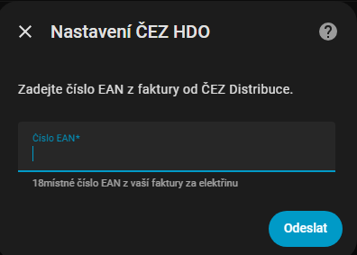
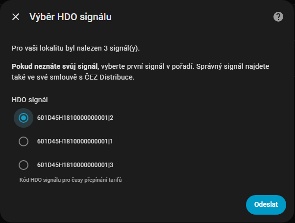
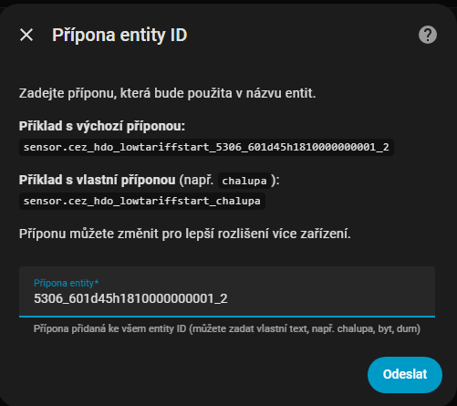
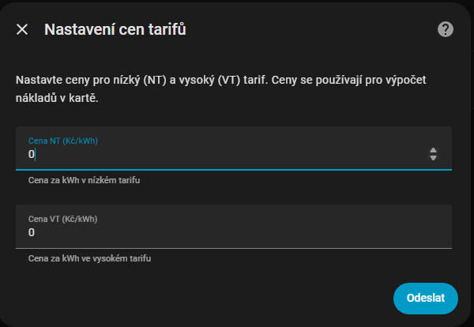
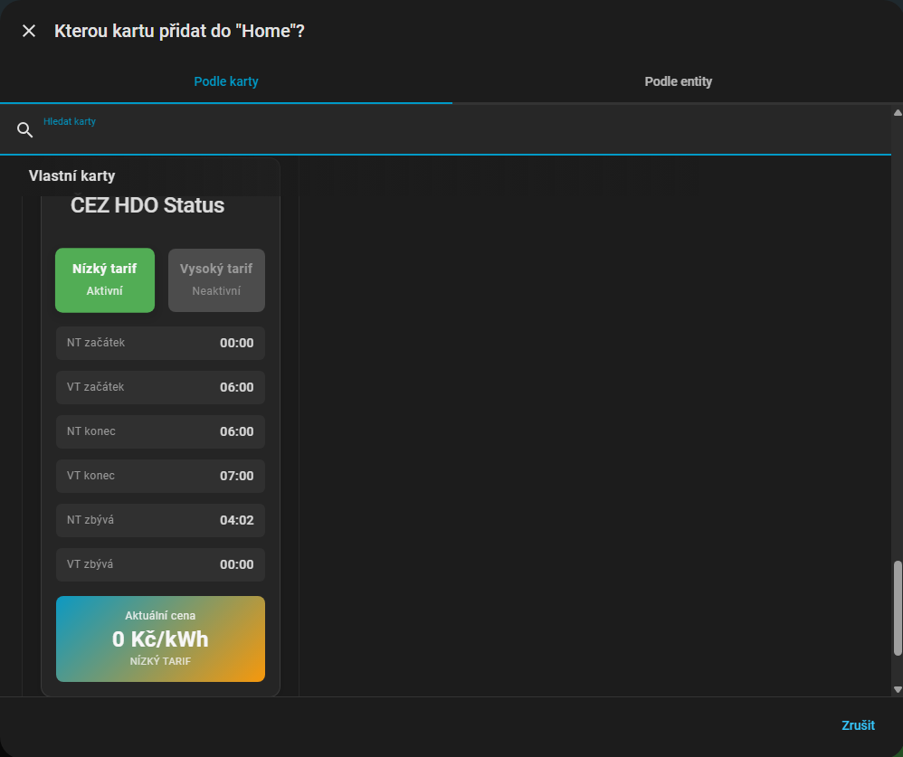
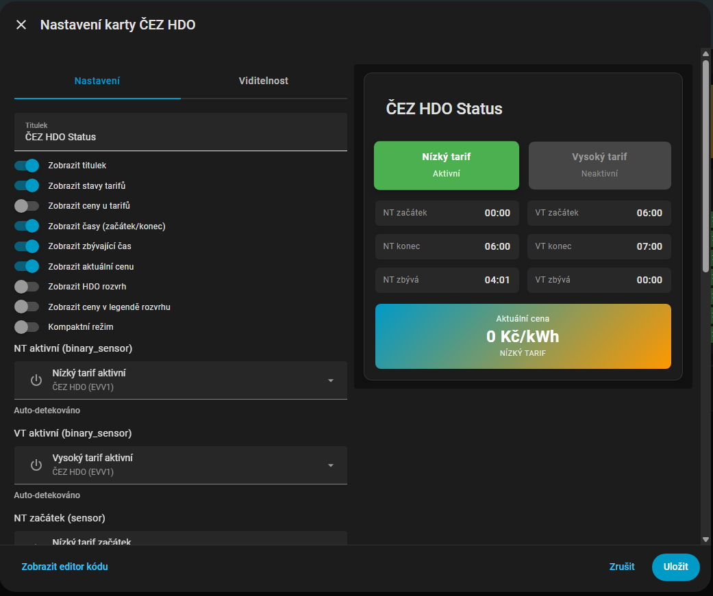
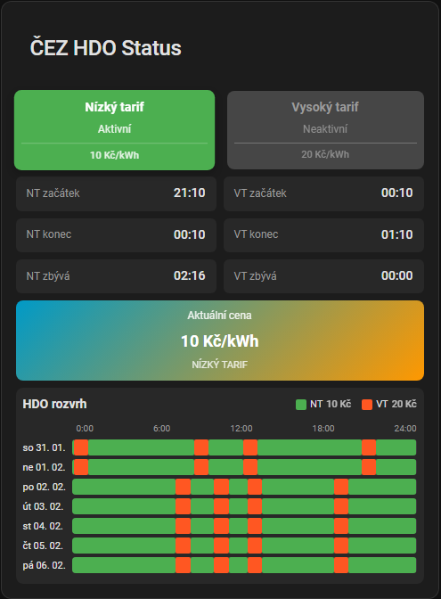
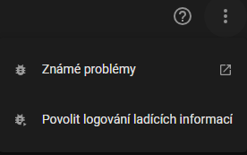
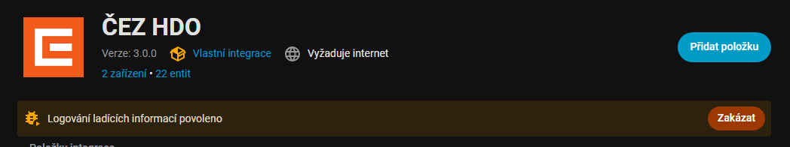

# ⚡️ ČEZ HDO – Uživatelská příručka

Kompletní návod pro instalaci, konfiguraci a používání integrace ČEZ HDO v Home Assistantu.

---

## 📑 Obsah

- [🚀 Instalace](#-instalace)
- [⚙️ Konfigurace integrace](#️-konfigurace-integrace)
- [🎴 Přidání karty na dashboard](#-přidání-karty-na-dashboard)
- [📦 Vytvářené entity](#-vytvářené-entity)
- [💰 Nastavení cen](#-nastavení-cen)
- [📊 Energy Dashboard](#-energy-dashboard)
- [📅 HDO rozvrh](#-hdo-rozvrh)
- [🔧 Řešení problémů](#-řešení-problémů)
- [� Debug logování](#-debug-logování)
- [�📊 Diagnostika](#-diagnostika)

---

## 🚀 Instalace

### Instalace přes HACS (doporučeno)

1. Otevřete **HACS → Integrations**
2. Klikněte na **⋮** → **Custom repositories**
3. Přidejte repozitář:

[](https://my.home-assistant.io/redirect/hacs_repository/?category=Integration&owner=Cmajda&repository=ha_cez_distribuce)

4. Nainstalujte integraci **ČEZ HDO**
5. **Restartujte Home Assistant**

### Po instalaci

Po restartu pokračujte konfigurací integrace (viz další sekce).

> **Poznámka:** Po instalaci/aktualizaci může být potřeba stisknout
> `Ctrl+F5` pro vyčištění cache prohlížeče.

---

## ⚙️ Konfigurace integrace

Od verze 3.0.0 se integrace konfiguruje výhradně přes grafické rozhraní (GUI).

### Přidání integrace

1. Přejděte do **Nastavení → Zařízení a služby**
2. Klikněte na tlačítko **+ Přidat integraci**
3. Do vyhledávacího pole napište **ČEZ HDO**
4. Vyberte integraci ze seznamu



### Krok 1: Zadání EAN

Zadejte vaše **EAN číslo** (18 číslic) a klikněte na **Odeslat**.


EAN najdete:

- Na faktuře / vyúčtování za elektřinu
- V portálu vašeho dodavatele elektřiny
- Na stránkách [ČEZ Distribuce](https://www.cezdistribuce.cz/cs/pro-zakazniky/spinani-hdo)

### Krok 2: Výběr signálu

Vyberte **HDO signál** ze seznamu dostupných signálů pro vaše odběrné místo.



- **Pokud si nejste jisti signálem**, můžete ho najít ve své smlouvě s ČEZ Distribuce
- Pokud signál neznáte, ponechte výchozí hodnotu (první signál v seznamu)
- Signál určuje, kdy se přepíná mezi nízkým (NT) a vysokým (VT) tarifem
- **Stejné EAN lze přidat vícekrát s různými signály**

Po výběru signálu klikněte na **Odeslat**.

### Krok 3: Přípona Entity ID

Zadejte **příponu**, která bude použita v názvech všech entit.



- **Výchozí hodnota:** `{poslední 4 číslice EAN}_{signál}` (např. `7606_a1b4dp04`)
- **Vlastní přípona:** Můžete zadat vlastní text pro lepší orientaci (např. `chalupa`, `byt`, `dum`)

**Příklady výsledných entity ID:**

| Přípona | Výsledné entity ID |
|---------|-------------------|
| `7606_a1b4dp04` | `sensor.cez_hdo_nizky_tarif_zacatek_7606_a1b4dp04` |
| `chalupa` | `sensor.cez_hdo_nizky_tarif_zacatek_chalupa` |

> **Tip:** Použijte intuitivní názvy pro snadnější orientaci v automatizacích, zejména pokud máte více odběrných míst.

Klikněte na **Odeslat**.

### Krok 4: Nastavení cen

Zadejte ceny elektřiny pro nízký a vysoký tarif.



| Pole | Popis |
|------|-------|
| **Cena NT (Kč/kWh)** | Cena za kWh v nízkém tarifu |
| **Cena VT (Kč/kWh)** | Cena za kWh ve vysokém tarifu |

Ceny najdete na faktuře nebo v ceníku od vašeho dodavatele elektřiny. Tyto ceny se používají pro výpočet nákladů v kartě a pro integraci s Energy Dashboard.

Klikněte na **Odeslat**.

### Krok 5: Umístění zařízení

Home Assistant se zeptá, do které oblasti chcete zařízení umístit.


- Vyberte oblast (místnost) pro vaše zařízení, nebo
- Klikněte na **Přeskočit** a dokončete konfiguraci

🎉 **Gratulujeme!** Integrace je nyní nakonfigurována a vytvoří:

- Zařízení "ČEZ HDO XXXXXX" (posledních 6 číslic EAN)
- Všechny senzory a binární senzory

---

## 🎴 Přidání karty na dashboard

### Krok 1: Úprava dashboardu

1. Otevřete dashboard, na který chcete kartu přidat
2. Klikněte na **⋮** (tři tečky) v pravém horním rohu
3. Vyberte **Upravit dashboard**

### Krok 2: Přidání karty

1. Klikněte na **+ Přidat kartu**
2. Do vyhledávacího pole napište **ČEZ HDO**
3. Vyberte kartu **ČEZ HDO Card**



### Krok 3: Nastavení karty

Otevře se editor karty s možnostmi konfigurace.



> **Tip:** Pokud je toto vaše první (nebo jediné) EAN, karta automaticky doplní všechny entity. Ceny zadané při konfiguraci integrace budou automaticky načteny.

#### Možnosti nastavení karty

| Přepínač | Popis | Výchozí |
|----------|-------|---------|
| **Zobrazit titulek** | Nadpis karty | ✅ Zapnuto |
| **Zobrazit stavy tarifů** | Boxy NT/VT se stavem (aktivní/neaktivní) | ✅ Zapnuto |
| **Zobrazit ceny u tarifů** | Cena v boxu NT/VT | ❌ Vypnuto |
| **Zobrazit časy** | Čas začátku a konce tarifů | ✅ Zapnuto |
| **Zobrazit zbývající čas** | Čas do změny tarifu | ✅ Zapnuto |
| **Zobrazit aktuální cenu** | Velký box s aktuální cenou | ✅ Zapnuto |
| **Zobrazit HDO rozvrh** | 7denní vizualizace rozvrhu | ❌ Vypnuto |
| **Zobrazit ceny v legendě** | Ceny u NT/VT v legendě rozvrhu | ❌ Vypnuto |
| **Kompaktní režim** | Zmenšená velikost karty | ❌ Vypnuto |

#### Výběr entit

Karta automaticky detekuje entity ČEZ HDO. Pokud máte **více instancí integrace** (více EAN nebo více signálů pro jedno EAN), je nutné správně nastavit entity:

1. Rozbalte sekci **Entity**
2. Vyberte správné entity pro vámi požadované EAN/signál

Po dokončení nastavení klikněte na **Uložit**.

### Výsledek

Karta bude zobrazena na vybraném dashboardu.



---

## 📦 Vytvářené entity

Integrace vytváří následující entity:

### Binary sensors

| Entita | Popis |
|--------|-------|
| `binary_sensor.cez_hdo_*_nizky_tarif_aktivni` | Nízký tarif je aktivní (`on/off`) |
| `binary_sensor.cez_hdo_*_vysoky_tarif_aktivni` | Vysoký tarif je aktivní (`on/off`) |

### Sensors

| Entita | Popis |
|--------|-------|
| `sensor.cez_hdo_*_nizky_tarif_zacatek` | Čas začátku NT (např. `01:10`) |
| `sensor.cez_hdo_*_nizky_tarif_konec` | Čas konce NT (např. `08:30`) |
| `sensor.cez_hdo_*_nizky_tarif_zbyva` | Zbývající čas do změny tarifu |
| `sensor.cez_hdo_*_vysoky_tarif_zacatek` | Čas začátku VT |
| `sensor.cez_hdo_*_vysoky_tarif_konec` | Čas konce VT |
| `sensor.cez_hdo_*_vysoky_tarif_zbyva` | Zbývající čas do změny tarifu |
| `sensor.cez_hdo_*_aktualni_cena` | Aktuální cena v Kč/kWh |
| `sensor.cez_hdo_*_rozvrh` | 7denní HDO rozvrh |
| `sensor.cez_hdo_*_surova_data` | Timestamp poslední aktualizace |

> **Poznámka:** `*` označuje vaši zvolenou příponu z kroku 3 (např. `7606_a1b4dp04` nebo `chalupa`).

### Více EAN / signálů

Integrace podporuje:

- **Více různých EAN** – každé přidáte jako novou instanci integrace
- **Stejné EAN s různými signály** – každý signál jako nová instance

Každá instance má vlastní zařízení a entity s unikátní příponou.

---

## 💰 Nastavení cen

Ceny se nastavují **v integraci**, ne v kartě.

### Změna cen

1. Přejděte do **Nastavení → Zařízení a služby**
2. Najděte integraci **ČEZ HDO** a klikněte na ni
3. Klikněte na **Konfigurovat**
4. Projděte kroky až ke **Nastavení cen tarifů**
5. Změňte ceny a uložte

### Služba set_prices

Ceny lze nastavit i programově přes službu:

```yaml
service: cez_hdo.set_prices
data:
  low_tariff_price: 2.50
  high_tariff_price: 4.50
```

---

## 📊 Energy Dashboard

Senzor `sensor.cez_hdo_*_aktualni_cena` lze použít v Energy Dashboard pro sledování nákladů:

1. Přejděte do **Nastavení → Dashboardy → Energie**
2. V sekci "Elektrická síť" klikněte na **Přidat spotřebu**
3. Vyberte váš měřič spotřeby elektřiny
4. V poli "Použít entitu s aktuální cenou" vyberte `sensor.cez_hdo_*_aktualni_cena`

---

## 📅 HDO rozvrh

Karta obsahuje vizualizaci 7denního HDO rozvrhu:

### Aktivace

1. Otevřete editor karty
2. Zapněte přepínač **Zobrazit HDO rozvrh**
3. Volitelně zapněte **Zobrazit ceny v legendě rozvrhu**

### Popis rozvrhu

- **Zelené bloky** – nízký tarif (NT)
- **Oranžové bloky** – vysoký tarif (VT)
- **Časová osa** – 0:00 až 24:00
- **Tooltip** – přesné časy při najetí myší na blok

---

## 🔧 Řešení problémů

### Karta se nezobrazuje

1. Stiskněte `Ctrl+F5` pro vyčištění cache prohlížeče
2. Zkontrolujte, že URL `http://IP_HA:8123/cez_hdo/cez-hdo-card.js` vrací odpověď (status 200)
3. Zkontrolujte konzoli prohlížeče (F12) pro případné chyby

### Entity nejsou k dispozici

1. Přejděte do **Nastavení → Zařízení a služby → ČEZ HDO**
2. Ověřte, že integrace nemá chybu (červená ikona)
3. Klikněte na **⋮** a vyberte **Znovu načíst** u integrace

### Chyba "Neplatný EAN" nebo "Nepodařilo se načíst signály"

- Ověřte, že EAN je správný (18 číslic)
- Zkontrolujte [portál ČEZ Distribuce](https://www.cezdistribuce.cz/cs/pro-zakazniky/spinani-hdo) ručně
- API ČEZ může být dočasně nedostupné – zkuste to později

### Kompletní reset

1. Přejděte do **Nastavení → Zařízení a služby → ČEZ HDO → Smazat**
2. Smažte složku `custom_components/cez_hdo/data/`
3. Restartujte Home Assistant
4. Přidejte integraci znovu

---

## � Debug logování

Pokud potřebujete získat podrobné logy pro diagnostiku problému, můžete zapnout debug logování přímo v Home Assistantu.

### Krok 1: Zapnutí debug logování

1. Přejděte do **Nastavení → Zařízení a služby**
2. Vyberte integraci **ČEZ HDO**
3. Klikněte na **⋮** (tři tečky) v pravém horním rohu
4. Zvolte **Povolit logování ladících informací**



### Krok 2: Reprodukce problému

Proveďte kroky, které vedou k vyvolání chyby nebo špatného chování integrace. Logy budou zaznamenávat všechny operace integrace.

### Krok 3: Vypnutí debug logování a stažení logů

1. Přejděte do **Nastavení → Zařízení a služby**
2. Vyberte integraci **ČEZ HDO**
3. Klikněte na informační zobrazení **„Logování ladících informací povoleno“**
4. Klikněte na **Zakázat**



### Krok 4: Stažení souboru s logy

Po kliknutí na **Zakázat** Home Assistant automaticky vygeneruje soubor s debug informacemi a vyzve vás ke stažení.

1. Uložte stažený soubor
2. Tento soubor přiložte k vašemu GitHub Issue

> **Tip:** Debug logy obsahují podrobné informace o všech operacích integrace a jsou velmi užitečné pro diagnostiku problémů.

---

## �📊 Diagnostika

Pro nahlášení chyby na GitHubu exportujte diagnostická data:

### Export diagnostiky

1. Přejděte do **Nastavení → Zařízení a služby → ČEZ HDO**
2. Klikněte na zařízení
3. Klikněte na **⋮** (tři tečky) vpravo nahoře
4. Vyberte **Stáhnout diagnostiku**
5. Uložte JSON soubor

### Co diagnostika obsahuje

- Stav všech senzorů (hodnoty, atributy)
- Obsah cache (HDO rozvrh)
- Nastavení integrace (signál, ceny)
- **Citlivé údaje jsou maskovány** (EAN, partner, vkont, vstelle, anlage)

### Přiložení k issue

1. Otevřete [GitHub Issues](https://github.com/Cmajda/ha_cez_distribuce/issues)
2. Vytvořte nový issue
3. Přiložte diagnostický JSON soubor
4. Popište problém co nejpodrobněji

---

## 📚 Další dokumentace

- [Upgrade Guide](upgrade-guide.md) – postup upgradu z v2.x na v3.0.0
- [Developer Guide](developer-guide.md) – pro vývojáře
- [Service Guide](service-guide.md) – popis dostupných služeb
