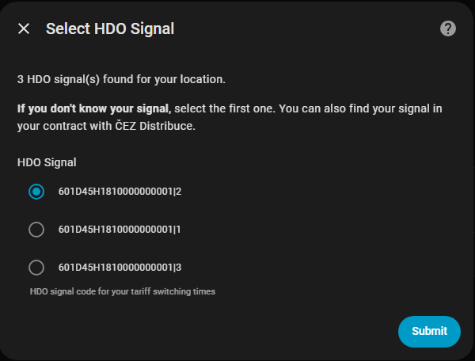
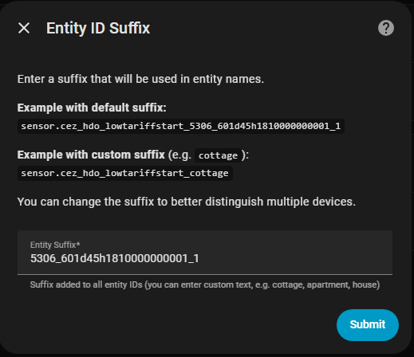
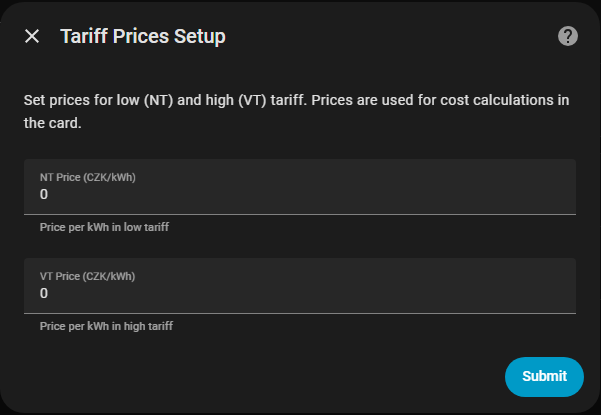
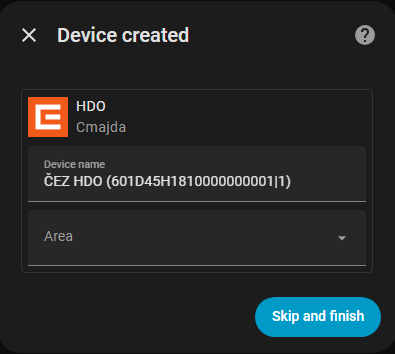
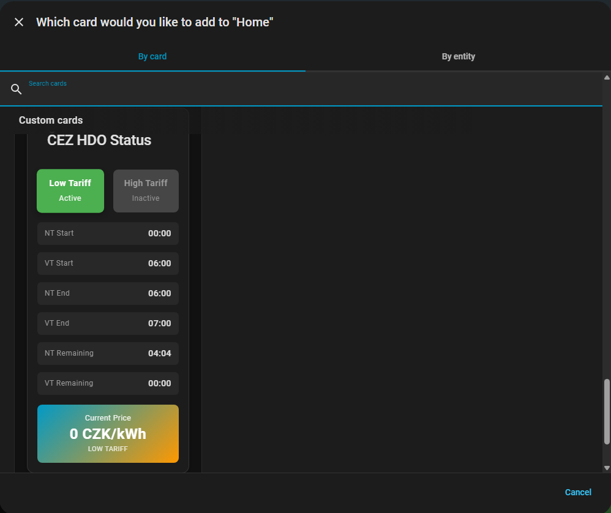
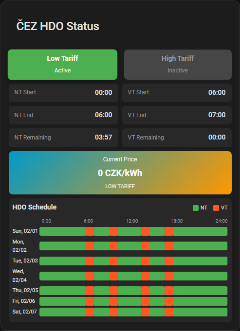
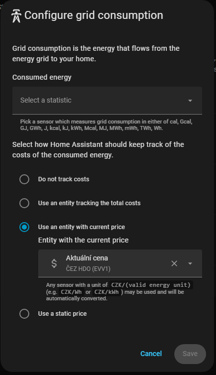
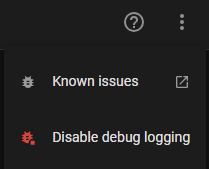
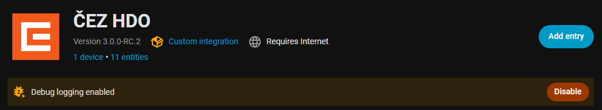

# ⚡️ ČEZ HDO – User Guide

Complete guide for installation, configuration, and usage of the ČEZ HDO integration in Home Assistant.

---

## 📑 Table of Contents

- [🚀 Installation](#-installation)
- [⚙️ Integration Configuration](#️-integration-configuration)
- [🎴 Adding Card to Dashboard](#-adding-card-to-dashboard)
- [📦 Created Entities](#-created-entities)
- [💰 Price Settings](#-price-settings)
- [📊 Energy Dashboard](#-energy-dashboard)
- [📅 HDO Schedule](#-hdo-schedule)
- [🔧 Troubleshooting](#-troubleshooting)
- [🐛 Debug Logging](#-debug-logging)
- [📊 Diagnostics](#-diagnostics)

---

## 🚀 Installation

### Installation via HACS (recommended)

1. Open **HACS → Integrations**
2. Click on **⋮** → **Custom repositories**
3. Add the repository:

[](https://my.home-assistant.io/redirect/hacs_repository/?category=Integration&owner=Cmajda&repository=ha_cez_distribuce)

1. Install the **ČEZ HDO** integration
2. **Restart Home Assistant**

### After Installation

After restart, proceed with the integration configuration (see next section).

> **Note:** After installation/update, you may need to press
> `Ctrl+F5` to clear browser cache.

---

## ⚙️ Integration Configuration

Starting from version 3.0.0, the integration is configured exclusively through the graphical interface (GUI).

### Adding the Integration

1. Go to **Settings → Devices & Services**
2. Click the **+ Add Integration** button
3. Type **ČEZ HDO** in the search field
4. Select the integration from the list


### Step 1: Enter EAN

Enter your **EAN number** (18 digits) and click **Submit**.


You can find your EAN:

- On your electricity invoice / bill
- In your electricity provider's portal
- On the [ČEZ Distribuce](https://www.cezdistribuce.cz/cs/pro-zakazniky/spinani-hdo) website

### Step 2: Select Signal

Select the **HDO signal** from the list of available signals for your metering point.



- **If you're unsure about your signal**, you can find it in your contract with ČEZ Distribuce
- If you don't know your signal, keep the default value (first signal in the list)
- The signal determines when switching between low (NT) and high (VT) tariff occurs
- **The same EAN can be added multiple times with different signals**

After selecting the signal, click **Submit**.

### Step 3: Entity ID Suffix

Enter a **suffix** that will be used in all entity names.



- **Default value:** `{last 4 digits of EAN}_{signal}` (e.g., `7606_a1b4dp04`)
- **Custom suffix:** You can enter custom text for better orientation (e.g., `cottage`, `apartment`, `house`)

**Examples of resulting entity IDs:**

| Suffix | Resulting Entity ID |
|--------|---------------------|
| `7606_a1b4dp04` | `sensor.cez_hdo_lowtariffstart_7606_a1b4dp04` |
| `cottage` | `sensor.cez_hdo_lowtariffstart_cottage` |

> **Tip:** Use intuitive names for easier navigation in automations, especially if you have multiple metering points.

Click **Submit**.

### Step 4: Price Settings

Enter electricity prices for low and high tariff.



| Field | Description |
|-------|-------------|
| **NT Price (CZK/kWh)** | Price per kWh in low tariff |
| **VT Price (CZK/kWh)** | Price per kWh in high tariff |

You can find prices on your invoice or in the price list from your electricity provider. These prices are used for cost calculations in the card and for integration with Energy Dashboard.

Click **Submit**.

### Step 5: Device Placement

Home Assistant will ask which area you want to place the device in.



- Select an area (room) for your device, or
- Click **Skip** to finish configuration

🎉 **Congratulations!** The integration is now configured and will create:

- Device "ČEZ HDO XXXXXX" (last 6 digits of EAN)
- All sensors and binary sensors

---

## 🎴 Adding Card to Dashboard

### Step 1: Edit Dashboard

1. Open the dashboard where you want to add the card
2. Click **⋮** (three dots) in the top right corner
3. Select **Edit Dashboard**

### Step 2: Add Card

1. Click **+ Add Card**
2. Type **ČEZ HDO** in the search field
3. Select the **ČEZ HDO Card**



### Step 3: Configure Card

The card editor will open with configuration options.


> **Tip:** If this is your first (or only) EAN, the card will automatically populate all entities. Prices entered during integration configuration will be automatically loaded.

#### Card Configuration Options

| Toggle | Description | Default |
|--------|-------------|---------|
| **Show title** | Card header | ✅ On |
| **Show tariff states** | NT/VT boxes with state (active/inactive) | ✅ On |
| **Show prices with tariffs** | Price in NT/VT box | ❌ Off |
| **Show times** | Tariff start and end times | ✅ On |
| **Show remaining time** | Time until tariff change | ✅ On |
| **Show current price** | Large box with current price | ✅ On |
| **Show HDO schedule** | 7-day schedule visualization | ❌ Off |
| **Show prices in legend** | Prices for NT/VT in schedule legend | ❌ Off |
| **Compact mode** | Reduced card size | ❌ Off |

#### Entity Selection

The card automatically detects ČEZ HDO entities. If you have **multiple integration instances** (multiple EANs or multiple signals for one EAN), you need to correctly set the entities:

1. Expand the **Entities** section
2. Select the correct entities for your desired EAN/signal

After completing the settings, click **Save**.

### Result

The card will be displayed on the selected dashboard.



---

## 📦 Created Entities

The integration creates the following entities:

### Binary Sensors

| Entity | Description |
|--------|-------------|
| `binary_sensor.cez_hdo_lowtariffactive_*` | Low tariff is active (`on/off`) |
| `binary_sensor.cez_hdo_hightariffactive_*` | High tariff is active (`on/off`) |

### Sensors

| Entity | Description |
|--------|-------------|
| `sensor.cez_hdo_lowtariffstart_*` | NT start time (e.g., `01:10`) |
| `sensor.cez_hdo_lowtariffend_*` | NT end time (e.g., `08:30`) |
| `sensor.cez_hdo_lowtariffremaining_*` | Remaining time until tariff change |
| `sensor.cez_hdo_hightariffstart_*` | VT start time |
| `sensor.cez_hdo_hightariffend_*` | VT end time |
| `sensor.cez_hdo_hightariffremaining_*` | Remaining time until tariff change |
| `sensor.cez_hdo_currentprice_*` | Current price in CZK/kWh |
| `sensor.cez_hdo_schedule_*` | 7-day HDO schedule |
| `sensor.cez_hdo_rawdata_*` | Last update timestamp |

> **Note:** `*` represents your chosen suffix from step 3 (e.g., `7606_a1b4dp04` or `cottage`).

### Multiple EANs / Signals

The integration supports:

- **Multiple different EANs** – each added as a new integration instance
- **Same EAN with different signals** – each signal as a new instance

Each instance has its own device and entities with a unique suffix.

---

## 💰 Price Settings

Prices are set **in the integration**, not in the card.

### Changing Prices

1. Go to **Settings → Devices & Services**
2. Find the **ČEZ HDO** integration and click on it
3. Click **Configure**
4. Navigate through steps to **Tariff Prices Setup**
5. Change prices and save

### set_prices Service

Prices can also be set programmatically via service in **Developer Tools → Services**:

```yaml
service: cez_hdo.set_prices
data:
  low_tariff_price: 2.50
  high_tariff_price: 4.50
```

> **⚠️ Limitation:** In the current version, this service sets prices for all integration instances.
> Device-specific price setting will be added in a future version.

---

## 📊 Energy Dashboard

The `sensor.cez_hdo_*_currentprice` sensor can be used in Energy Dashboard for cost tracking:

1. Go to **Settings → Dashboards → Energy**
2. In the "Electricity grid" section, click **Add consumption**
3. Select your electricity consumption meter
4. In the "Use an entity with current price" field, select `sensor.cez_hdo_*_currentprice`



---

## 📅 HDO Schedule

The card includes a 7-day HDO schedule visualization:

### Activation

1. Open the card editor
2. Enable the **Show HDO schedule** toggle
3. Optionally enable **Show prices in schedule legend**

### Schedule Description

- **Green blocks** – low tariff (NT)
- **Orange blocks** – high tariff (VT)
- **Timeline** – 0:00 to 24:00
- **Tooltip** – exact times when hovering over a block

---

## 🔧 Troubleshooting

### Card Not Displaying

1. Press `Ctrl+F5` to clear browser cache
2. Check that URL `http://HA_IP:8123/cez_hdo/cez-hdo-card.js` returns a response (status 200)
3. Check browser console (F12) for any errors

### Entities Not Available

1. Go to **Settings → Devices & Services → ČEZ HDO**
2. Verify the integration doesn't have an error (red icon)
3. Click **⋮** and select **Reload** for the integration

### Error "Invalid EAN" or "Failed to Load Signals"

- Verify the EAN is correct (18 digits)
- Check the [ČEZ Distribuce portal](https://www.cezdistribuce.cz/cs/pro-zakazniky/spinani-hdo) manually
- ČEZ API may be temporarily unavailable – try again later

### Complete Reset

1. Go to **Settings → Devices & Services → ČEZ HDO → Delete**
2. Delete the `custom_components/cez_hdo/data/` folder
3. Restart Home Assistant
4. Add the integration again

---

## � Debug Logging

If you need to obtain detailed logs for diagnosing a problem, you can enable debug logging directly in Home Assistant.

### Step 1: Enable Debug Logging

1. Go to **Settings → Devices & Services**
2. Select the **ČEZ HDO** integration
3. Click **⋮** (three dots) in the top right corner
4. Select **Enable debug logging**



### Step 2: Reproduce the Problem

Perform the steps that lead to the error or incorrect behavior of the integration. The logs will record all integration operations.

### Step 3: Disable Debug Logging and Download Logs

1. Go to **Settings → Devices & Services**
2. Select the **ČEZ HDO** integration
3. Click on the info banner **“Debug logging enabled”**
4. Click **Disable**



### Step 4: Download the Log File

After clicking **Disable**, Home Assistant will automatically generate a file with debug information and prompt you to download it.

1. Save the downloaded file
2. Attach this file to your GitHub Issue

> **Tip:** Debug logs contain detailed information about all integration operations and are very useful for diagnosing problems.

---

## 📊 Diagnostics

To report a bug on GitHub, export diagnostic data:

### Export Diagnostics

1. Go to **Settings → Devices & Services → ČEZ HDO**
2. Click on the device
3. Click **⋮** (three dots) in the top right
4. Select **Download diagnostics**
5. Save the JSON file

### What Diagnostics Contain

- State of all sensors (values, attributes)
- Cache contents (HDO schedule)
- Integration settings (signal, prices)
- **Sensitive data is masked** (EAN, partner, vkont, vstelle, anlage)

### Attaching to Issue

1. Open [GitHub Issues](https://github.com/Cmajda/ha_cez_distribuce/issues)
2. Create a new issue
3. Attach the diagnostic JSON file
4. Describe the problem in detail

---

## 📚 Additional Documentation

- [Upgrade Guide](upgrade-guide.md) – upgrade procedure from v2.x to v3.0.0
- [Developer Guide](developer-guide.md) – for developers
- [Service Guide](service-guide.md) – description of available services
- [Known Issues](known-issues.md) – list of known issues and limitations
