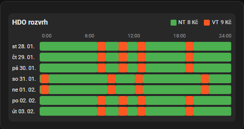

# ČEZ HDO – Uživatelská dokumentace

Tato stránka je kompletní návod pro běžného uživatele: instalace, konfigurace, vytvořené entity, Lovelace karta a řešení problémů.

## Instalace

### Instalace přes HACS (doporučeno)

1. Otevřete HACS → Integrations
1. Přidejte repozitář jako Custom repository (Integration):

[](https://my.home-assistant.io/redirect/hacs_repository/?category=Integration&owner=Cmajda&repository=ha_cez_distribuce)

1. Nainstalujte integraci „ČEZ HDO“
1. Restart Home Assistant

Poznámka: po instalaci/aktualizaci a restartu HA může být potřeba jednou udělat `Ctrl+F5`, aby se Lovelace karta objevila v seznamu karet.

## Konfigurace (`configuration.yaml`)

Přidejte do `configuration.yaml` přesně tento blok (EAN je povinný):

```yaml
sensor:
  - platform: cez_hdo
    ean: "Váš EAN"

binary_sensor:
  - platform: cez_hdo
    ean: "Váš EAN"
```

Pak restartujte Home Assistant.

### Kde najít EAN

EAN je identifikátor odběrného místa a najdete ho typicky:

- na faktuře / vyúčtování
- v portálu dodavatele/distributora

## Vytvářené entity a jejich význam

Integrace vytváří tyto entity (výchozí názvy):

### Binary sensors

- `binary_sensor.cez_hdo_nizky_tarif_aktivni` – nízký tarif je aktivní (`on/off`)
- `binary_sensor.cez_hdo_vysoky_tarif_aktivni` – vysoký tarif je aktivní (`on/off`)

### Sensors

- `sensor.cez_hdo_nizky_tarif_zacatek` – čas začátku nízkého tarifu (např. `01:10`)
- `sensor.cez_hdo_nizky_tarif_konec` – čas konce nízkého tarifu (např. `08:30`)
- `sensor.cez_hdo_nizky_tarif_zbyva` – zbývající čas do změny tarifu
- `sensor.cez_hdo_vysoky_tarif_zacatek` – čas začátku vysokého tarifu
- `sensor.cez_hdo_vysoky_tarif_konec` – čas konce vysokého tarifu
- `sensor.cez_hdo_vysoky_tarif_zbyva` – zbývající čas do změny tarifu
- `sensor.cez_hdo_aktualni_cena` – aktuální cena elektřiny v Kč/kWh (podle aktivního tarifu)
- `sensor.cez_hdo_rozvrh` – 7denní rozvrh HDO pro vizualizaci v kartě
- `sensor.cez_hdo_surova_data` – surová data / timestamp (diagnostika)

## Lovelace karta

### Přidání karty

V Lovelace přidejte kartu typu:

```yaml
type: custom:cez-hdo-card
```

### Nastavení entit v UI

- Karta má UI editor a nabízí výběr entit.
- Tip: když necháte nějaké pole prázdné, karta použije výchozí entity (pokud existují).

### Ruční registrace zdroje (jen pokud se karta nenačítá)

Pokud se karta v seznamu karet nezobrazuje ani po `Ctrl+F5`:

1. Nastavení → Dashboardy → Zdroje
1. Přidat zdroj
1. URL: `/cez_hdo/cez-hdo-card.js`
1. Typ: JavaScript Module
1. Restart Home Assistant

## Nastavení cen tarifů

### Nastavení v Lovelace kartě

V editoru karty najdete pole pro zadání cen:

- **Cena NT (Kč/kWh)** – cena za kWh v nízkém tarifu
- **Cena VT (Kč/kWh)** – cena za kWh ve vysokém tarifu

Po zadání cen a uložení karty se automaticky aktualizuje senzor `sensor.cez_hdo_aktualni_cena`.

### Nastavení přes službu

Ceny lze nastavit i přes službu:

```yaml
service: cez_hdo.set_prices
data:
  low_tariff_price: 2.50
  high_tariff_price: 4.50
```

### Zobrazení cen v kartě

V editoru karty jsou dva přepínače:

- **Zobrazit aktuální cenu** – zobrazí velký box s aktuální cenou
- **Zobrazit ceny u tarifů** – zobrazí cenu přímo v boxu NT/VT

## Použití v Energy Dashboard

Senzor `sensor.cez_hdo_aktualni_cena` lze použít jako zdroj ceny elektřiny v Energy kartě Home Assistantu.

1. Nastavení → Dashboardy → Energy
2. V sekci "Electricity grid" klikněte na "Add consumption"
3. Vyberte měřič spotřeby
4. V poli "Use an entity tracking the total costs" nebo "Use an entity with current price" vyberte `sensor.cez_hdo_aktualni_cena`

Senzor automaticky přepíná mezi cenou NT a VT podle aktivního tarifu.

## HDO rozvrh – vizualizace v kartě

Lovelace karta obsahuje integrovanou vizualizaci 7denního HDO rozvrhu:



### Aktivace rozvrhu

1. Otevřete editor karty
2. Zapněte přepínač "Zobrazit HDO rozvrh"
3. Volitelně zapněte "Zobrazit ceny v legendě rozvrhu" pro zobrazení cen NT/VT

### Popis vizualizace

- **Zelené bloky** – nízký tarif (NT)
- **Oranžové bloky** – vysoký tarif (VT)
- **Časová osa** – 0:00 až 24:00 pro každý den
- **Legenda** – s volitelným zobrazením cen
- **Tooltip** – při najetí myší zobrazí přesné časy intervalu

### Formát dat senzoru

Senzor `sensor.cez_hdo_rozvrh` poskytuje v atributu `schedule` seznam intervalů:

```json
[
  {"start": "2026-01-27T00:00:00", "end": "2026-01-27T07:15:00", "tariff": "NT", "value": 1},
  {"start": "2026-01-27T07:15:00", "end": "2026-01-27T08:15:00", "tariff": "VT", "value": 0}
]
```

- `tariff`: "NT" (nízký tarif) nebo "VT" (vysoký tarif)
- `value`: 1 pro NT, 0 pro VT

## Přehled přepínačů v editoru karty

| Přepínač                        | Popis                                 |
| ------------------------------- | ------------------------------------- |
| Zobrazit titulek                | Zobrazí/skryje nadpis karty           |
| Zobrazit stavy tarifů           | Zobrazí/skryje boxy s NT/VT stavem    |
| Zobrazit ceny u tarifů          | Zobrazí cenu přímo v boxu NT/VT       |
| Zobrazit časy (začátek/konec)   | Zobrazí časy začátku a konce tarifů   |
| Zobrazit zbývající čas          | Zobrazí zbývající čas do změny tarifu |
| Zobrazit aktuální cenu          | Zobrazí velký box s aktuální cenou    |
| Zobrazit HDO rozvrh             | Zobrazí 7denní vizualizaci rozvrhu    |
| Zobrazit ceny v legendě rozvrhu | Přidá ceny NT/VT k legendě grafu      |
| Kompaktní režim                 | Zmenší kartu                          |

## Co dělat, když komponenta nefunguje

Pokud se po instalaci/aktualizaci něco rozbije (karta nejde přidat, nejde načíst JS, nebo jsou chyby v konzoli), postupujte takto:

1. Vynutit refresh: `Ctrl+F5`
1. Odinstalovat doplněk
1. Pokud existuje složka `www/cez_hdo`, smažte ji
1. Znovu nainstalovat doplněk
1. Restart Home Assistant

## Diagnostika (když chcete poslat logy)

Nejrychlejší kontrola pro kartu:

- Otevřete v prohlížeči `http://IP_HA:8123/cez_hdo/cez-hdo-card.js`
  - pokud vrací `200`, zdroj existuje
  - pokud vrací `404`, karta se nenačte

Pro integraci:

- Nastavení → Systém → Protokoly (Logs)
- hledejte záznamy `custom_components.cez_hdo`
